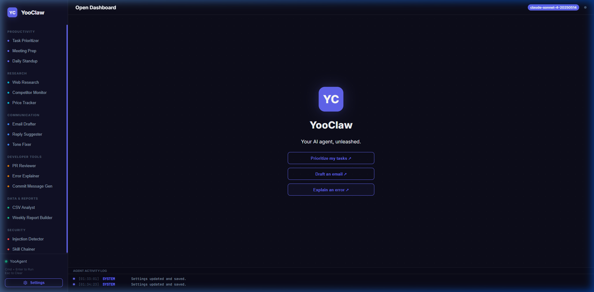
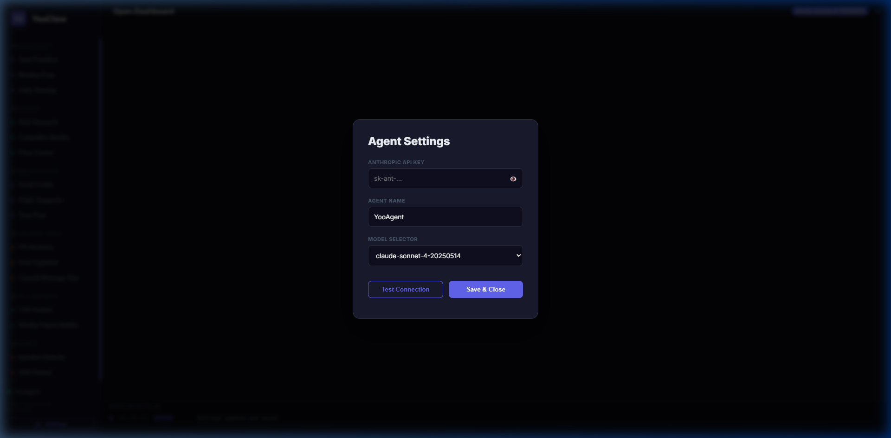
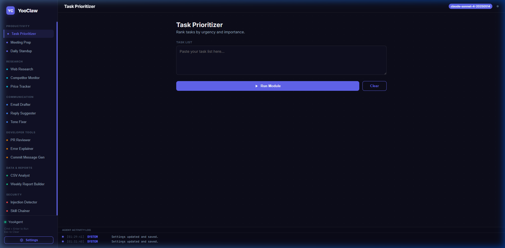
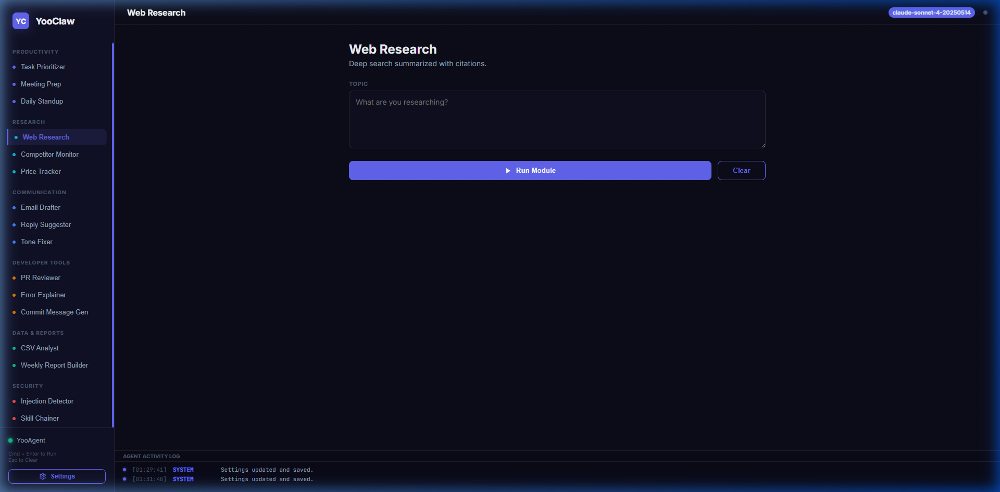
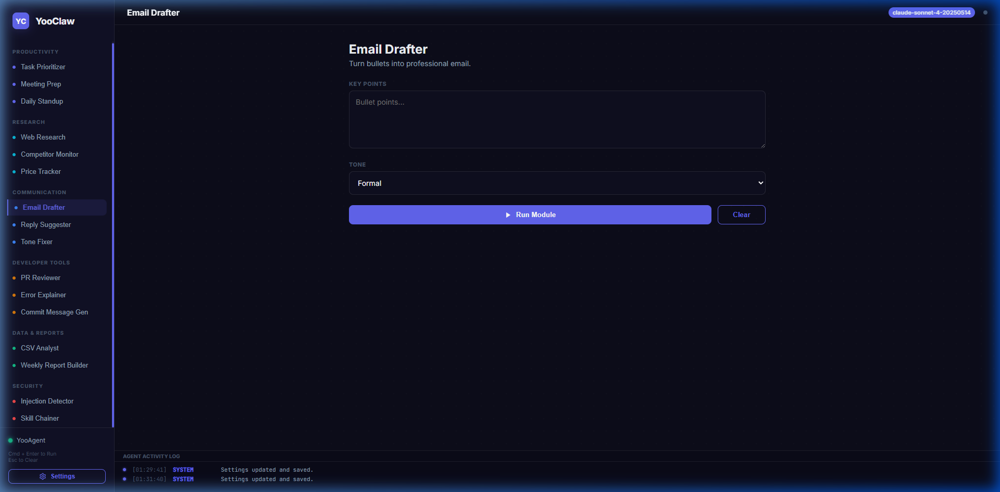
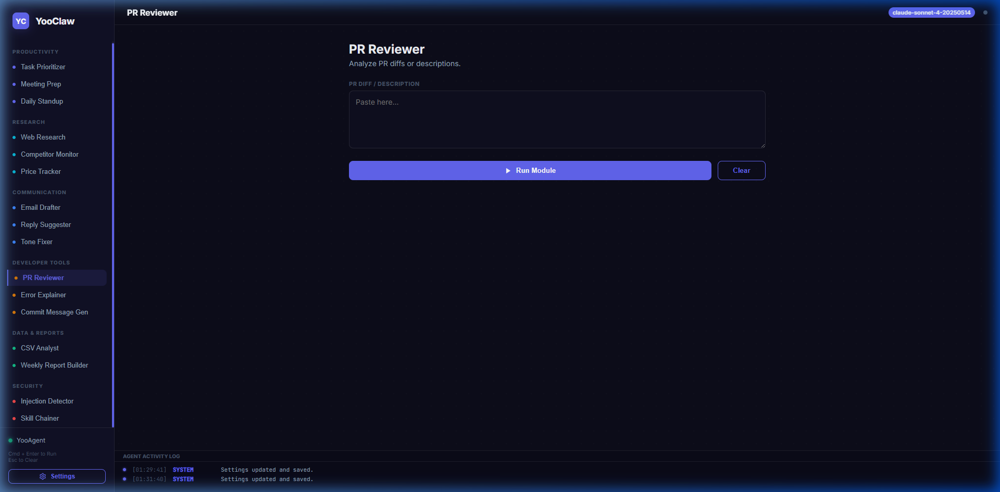
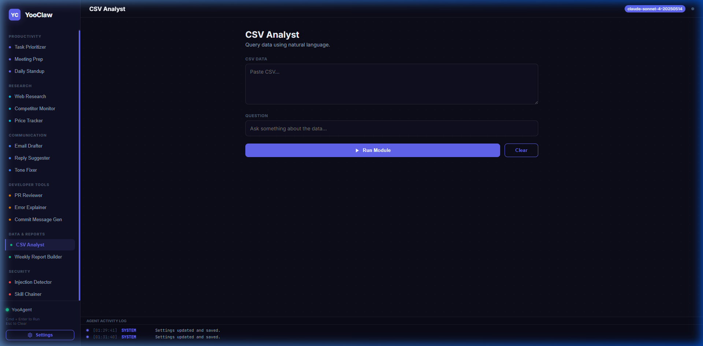
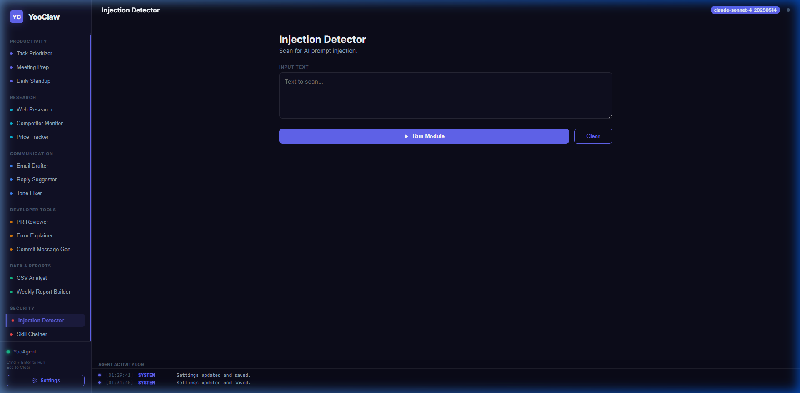

# YooClaw: Your AI Agent Unleashed

**YooClaw** is a professional, high-end AI productivity dashboard built to run directly in your browser. It integrates seamlessly with the **Anthropic Claude API** to provide institutional-grade intelligence for developers, researchers, and communicators.

## 🚀 Key Features

### 1. Secure Setup & Connectivity
YooClaw prioritizes your security. On the first launch, you are greeted with a dedicated settings modal to securely input your Anthropic API Key (saved only to your local storage). The dashboard includes a built-in "Connection Tester" to verify your credentials.

### 2. Specialized Intelligence Modules
The dashboard is divided into 6 core operational sectors, each featuring custom-tuned system prompts for optimized Claude responses:

#### **Productivity**
Task Prioritizer (Eisenhower Matrix), Meeting Prep, Daily Standup.

#### **Research**
Web Summary, Competitor Monitoring, Price Strategies.

#### **Communication**
Email Drafter, Reply Suggester, Tone Fixer.

#### **Developer Tools**
GitHub PR Reviewer, Error Explainer, Commit Gen.

#### **Data & Reports**
CSV Analyst, Weekly Report Builder.

#### **Security**
Prompt Injection Detector, Skill Chainer.

## 🛠️ Technical Stack
- **Architecture**: Single-file HTML/CSS/JS (no build steps required).
- **Styling**: Vanilla CSS with modern design tokens (Electric Indigo theme).
- **Engine**: Direct `fetch()` integration with the Anthropic API.
- **Micro-Interactions**: CSS Shimmer loading skeletons, Pulsing status indicators, and Fade-in transitions.
- **Interactivity**: 
    - `Cmd/Ctrl + Enter`: Run current module
    - `Esc`: Clear workspace

## 📥 Getting Started
1. Open `index.html` in any modern web browser.
2. Enter your **Anthropic API Key** in the settings modal.
3. Select a module from the sidebar and start generating intelligence.

---
*Created by Antigravity for YooClaw 2026.*
